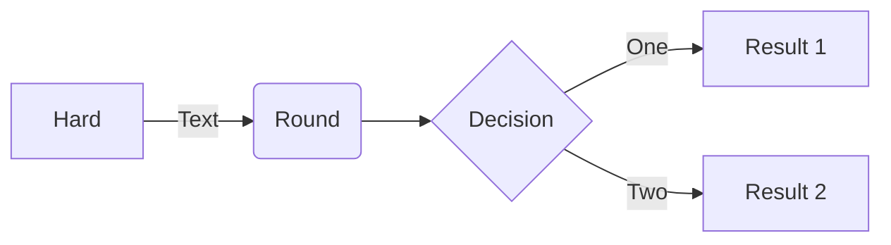

<!-- Block math, keep all blank lines -->

$$
LaTeX_math_expression
$$

<!-- Equation numbering, keep all blank lines  -->

$$
\begin{equation}
  LaTeX_math_expression
  \label{eq:label_name}
\end{equation}
$$

Can be referenced as \eqref{eq:label_name}.

<!-- Inline math in lines, NO blank lines -->

"Lorem ipsum dolor sit amet, $$ LaTeX_math_expression $$ consectetur adipiscing elit."

<!-- Inline math in lists, escape the first `$` -->

1. \$$ LaTeX_math_expression $$
2. \$$ LaTeX_math_expression $$
3. \$$ LaTeX_math_expression $$

_Image Caption_

{: w="700" h="400" }

{: .right }
